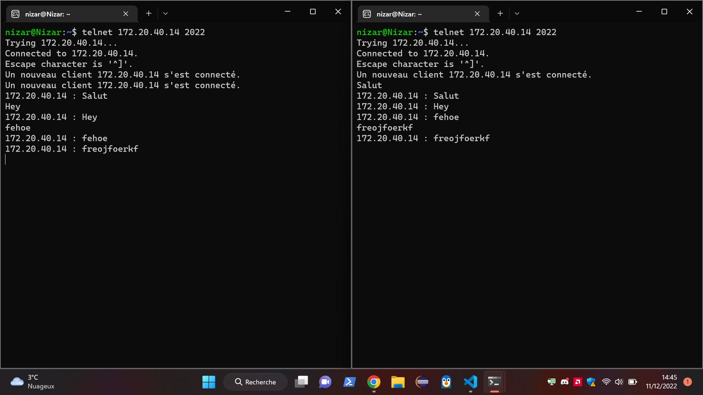

## Rapport pour le TP3

## Excercice 1

# Q1

Les étapes du traitement d'une requête sont l'ouverture d'une connexion sur le port spécifié, l'acceptation de la connexion entrante par le serveur, le traitement des données reçues et leur réponse par le serveur, et la fermeture de la connexion.

# Q2

Les exceptions à traiter pour chaque étape du programme sont IOException, SocketException et InterruptedException.

# Q3

Pour tester le bon fonctionnement du programme, on peut utiliser le client Telnet pour envoyer une requête et vérifier que le serveur renvoie bien le message «Bienvenue sur mon serveur et au revoir».

# Q4

Pour garder une trace des connexions ayant eu lieu, il est possible d'utiliser un tableau dans lequel chaque entrée correspond à une connexion et contient des informations sur l'état de cette dernière.

## Excercice 2

# Q1

Le nouveau Thread pour un client peut être créé lorsqu'un client se connecte au serveur.
# Q2

Les primitives pour recevoir des chaînes de caractères sur une Socket sont read() et readLine().
# Q3

Pour retransmettre les chaînes vers tous les utilisateurs connectés, nous pouvons utiliser des structures de données partagées telles que des listes et des maps. Ces structures peuvent être partagées entre les Threads en les passant au constructeur de chaque Thread.
# Q4

Pour garder une trace de toutes les connexions qui ont eu lieu, nous pouvons stocker les informations des clients dans une structure de données partagée, par exemple une liste ou une map. Chaque fois qu'un client se connecte ou déconnecte, nous pouvons mettre à jour cette structure de données.

# Q5

Lorsqu'un client telnet quitte normalement ou est intempestivement arrêté, nous pouvons utiliser une méthode de vérification pour nous assurer que le Thread associé ne se bloque pas en attendant des données. Nous pouvons par exemple utiliser une méthode de timeout où nous nous assurons que les données sont reçues dans un délai spécifique. Si le délai est dépassé, nous pouvons alors terminer le Thread.

## HOW TO 

Afin de lancer le ChatServer de l'exo 3, un fichier MakeFile est déjà fourni, il 

suffit simplement de taper la commande suivante depuis la racine du dossier TP3 :

    > make runExo2Server

Ceci entraînera la création du serveur, qui sera sur écoute sur le port 2022.

Afin de vous y connectez, vous pouvez utiliser le client Telnet. Pour ce, vous

 pouvez taper la commande suivante : 

    > telnet adresseIpDuServer 2022

Une fois connecté, le client telnet vous offre la possibilité d'envoyer des messages,

taper donc votre message et cliquer sur la touche Entrer pour l'envoyer.

Voici une capture d'écran d'un essai : 

